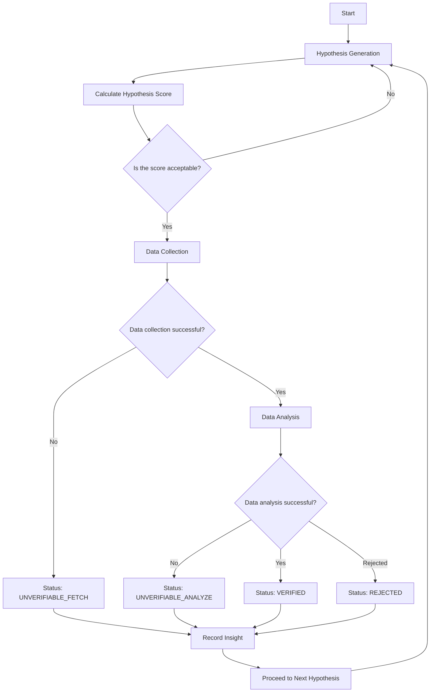

# Geo-Voyager: An Open-Ended AI Agent Mining Uncharted Real-World Geospatial Insights

```mermaid
graph TD
    A[Start] --> B[Hypothesis Generation]
    B --> C[Calculate Hypothesis Score]
    C --> D{Is the score acceptable?}
    D -- No --> B
    D -- Yes --> E[Data Collection]
    E --> F{Data collection successful?}
    F -- No --> G[Status: UNVERIFIABLE_FETCH]
    F -- Yes --> H[Data Analysis]
    H --> I{Data analysis successful?}
    I -- No --> J[Status: UNVERIFIABLE_ANALYZE]
    I -- Yes --> K[Status: VERIFIED]
    I -- Rejected --> L[Status: REJECTED]
    K --> M[Record Insight]
    L --> M
    G --> M
    J --> M
    M --> N[Proceed to Next Hypothesis]
    N --> B
```
