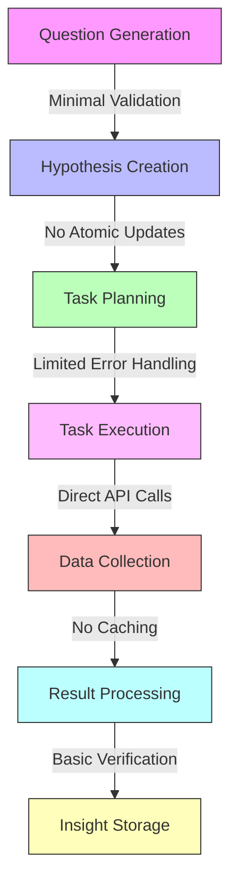

# Geo-Voyager Issues Analysis

## Overview
This document provides a comprehensive analysis of potential issues and areas for improvement in the Geo-Voyager project. The analysis covers architectural concerns, implementation challenges, and recommendations for future development.

## Table of Contents
1. [Question Generation](#question-generation)
2. [Hypothesis Creation & Verification](#hypothesis-creation--verification)
3. [Data Collection](#data-collection)
4. [Skills Library](#skills-library)
5. [Hypothesis & Insight Library](#hypothesis--insight-library)
6. [Recommendations](#recommendations)

## Question Generation

### Current Implementation
The question generation system is implemented in `src/db/question.ts` and uses a scoring mechanism (`calculateQuestionScore.ts`) to evaluate question quality. Questions are stored in a SQLite database using Prisma ORM and can have multiple states (OPEN, SOLVED, UNRESOLVABLE).

### Identified Issues
1. **Limited Question Generation Logic**: The system lacks sophisticated question generation capabilities, primarily relying on database operations rather than intelligent question formulation.
2. **Minimal Validation**: No comprehensive validation of generated questions beyond basic string checks and Levenshtein distance scoring.
3. **No Learning Mechanism**: The system doesn't learn from previously successful or failed questions to improve future generation.
4. **State Management Complexity**: Question states are managed through simple string enums without clear transition validation.

## Hypothesis Creation & Verification

### Current Implementation
Hypothesis generation is handled by `formulateNewHypothesis.ts` using the Ollama AI model. Verification occurs through `findAndExecuteTasksByHypothesis.ts` which manages task execution and updates hypothesis states based on results.

### Identified Issues
1. **Error Recovery**: Limited error handling in hypothesis verification:
   - No clear recovery strategy for failed verifications
   - Basic retry mechanism with fixed attempts (5 retries)
   - No gradual backoff strategy
2. **AI Model Dependencies**:
   - Hard-coded model selection (qwen2.5:14b)
   - No fallback models or versioning strategy
   - Limited prompt template management
3. **State Management**:
   - Complex state transitions across multiple files
   - No atomic operations for state updates
   - Risk of inconsistent states during failures

## Data Collection

### Current Implementation
Data collection is primarily handled through individual skill files in `src/lib/skills/` directory, with each skill implementing specific data collection logic for OpenStreetMap and other sources.

### Identified Issues
1. **API Integration**:
   - No centralized API rate limiting
   - Limited error handling for API failures
   - Missing comprehensive retry strategies
2. **Data Consistency**:
   - No validation of collected data
   - Inconsistent data format handling
   - Missing data normalization layer
3. **Caching Strategy**:
   - No clear caching mechanism
   - Potential redundant API calls
   - Missing cache invalidation strategy

## Skills Library

### Current Implementation
Skills are implemented as individual TypeScript files in `src/lib/skills/` with dynamic loading in `findAndExecuteTasksByHypothesis.ts`. New skills can be generated using `generateSkillForTask.ts`.

### Identified Issues
1. **Code Organization**:
   - High code duplication across skills
   - No clear abstraction layer for common operations
   - Limited reuse of shared functionality
2. **Skill Generation**:
   - Basic validation of generated skills
   - No comprehensive testing strategy
   - Limited skill versioning
3. **Execution Environment**:
   - Unsafe dynamic code execution
   - Limited sandbox environment
   - No resource usage limits

## Hypothesis & Insight Library

### Current Implementation
Hypotheses are managed through Prisma models with status tracking (PENDING, VERIFIED, REJECTED). Insights are implicitly stored as verified hypotheses without dedicated insight management.

### Identified Issues
1. **Insight Management**:
   - No dedicated insight storage
   - Limited categorization of insights
   - Missing relationship mapping between related insights
2. **Knowledge Base**:
   - No structured knowledge representation
   - Limited ability to build upon previous insights
   - Missing knowledge graph capabilities
3. **Verification Process**:
   - Linear verification approach
   - No parallel verification capabilities
   - Limited confidence scoring

## Recommendations

### Short-term Improvements
TBD

### Long-term Architectural Changes
TBD

## Appendix

### Code Examples

#### Question Generation - Limited Validation
```typescript
// src/utils/calculateQuestionScore.ts
const calculateQuestionScore = async (newQuestion: string): Promise<number> => {
  // Basic string-based validation only
  if (newQuestion.length < 10 || !newQuestion.endsWith("？")) {
    return 0;
  }
  
  // Simple Levenshtein distance check without semantic understanding
  const existingQuestions = await prisma.question.findMany();
  const similarities = existingQuestions.map(q => 
    calculateSimilarity(newQuestion, q.description)
  );
  return 1 - Math.max(...similarities);
};
```

#### Hypothesis Verification - Error Handling
```typescript
// src/utils/findAndExecuteTasksByHypothesis.ts
export const findAndExecuteTasksByHypothesis = async (hypothesis: Hypothesis) => {
  // Basic retry with no backoff strategy
  let retryCount = 0;
  while (retryCount < 5) {
    try {
      const result = await executeTask(task);
      return result;
    } catch (error) {
      console.error(`Task execution failed: ${error}`);
      retryCount++;
    }
  }
  // No sophisticated error recovery
  return null;
};
```

#### Data Collection - API Integration
```typescript
// src/lib/skills/getAllCountriesAlpha2Codes.ts
export const getAllCountriesAlpha2Codes = async (): Promise<string[]> => {
  // Direct API calls without rate limiting
  const response = await fetch('https://restcountries.com/v3.1/all');
  if (!response.ok) {
    console.error('Failed to fetch countries');
    return [];
  }
  const countries = await response.json();
  return countries.map((country: any) => country.cca2);
};
```

#### Skills Library - Code Duplication
```typescript
// src/lib/skills/checkMonacoIsMostDenselyPopulatedCountryInWorld.ts
// Similar data fetching logic repeated across multiple skill files
export const checkMonacoIsMostDenselyPopulatedCountryInWorld = async (): Promise<boolean> => {
  const response = await fetch('https://restcountries.com/v3.1/all');
  if (!response.ok) {
    console.error('Failed to fetch countries');
    return false;
  }
  // Duplicate data processing logic
  const countries = await response.json();
  return countries.sort((a: any, b: any) => 
    (b.population / b.area) - (a.population / a.area)
  )[0].cca2 === 'MC';
};
```

#### Hypothesis Management - State Transitions
```typescript
// src/utils/formulateNewHypothesis.ts
export const formulateNewHypothesis = async (question: Question): Promise<Hypothesis> => {
  // No atomic state updates
  const hypothesis = await prisma.hypothesis.create({
    data: {
      description: await generateHypothesisDescription(question),
      status: 'PENDING',
      questionId: question.id,
    },
  });
  
  // State changes without transaction
  await prisma.question.update({
    where: { id: question.id },
    data: { status: 'IN_PROGRESS' },
  });
  
  return hypothesis;
};
```

### Reference Architecture
The current architecture shows several areas where improvements could be made:



This diagram illustrates the tight coupling between components and the lack of proper error handling, caching, and state management layers.

## 改善提案

### 短期的な改善点

1. **エラー処理とロギング**
   - 集中型エラー処理サービスの実装
   - 重要度レベル付きの構造化ログ実装
   - 指数バックオフを含む適切なエラーリカバリー戦略の実装
   - 重要な操作のモニタリング追加

2. **API統合**
   - レート制限付きの集中型APIクライアントの作成
   - リクエストの再試行とサーキットブレーカーの実装
   - デバッグ用のリクエスト/レスポンスログの追加
   - API障害に対する適切なエラー処理の実装

3. **状態管理**
   - 状態変更のアトミック性を保証するトランザクションの実装
   - 適切な状態検証と遷移ルールの追加
   - 仮説ライフサイクル用の状態マシンの作成
   - 状態遷移失敗時の適切なエラーリカバリーの追加

### 長期的なアーキテクチャ変更

1. **AI制御**
   - 中央AIマネージャーモジュールの作成
   - モデルのバージョン管理とフォールバック戦略の実装
   - プロンプトテンプレート管理システムの追加
   - 適切なモデル評価指標の実装

2. **スキルフレームワーク**
   - 共通操作のための適切な抽象化層の作成
   - スキルテストフレームワークの実装
   - 適切なスキルのバージョン管理と非推奨化の追加
   - スキル依存関係管理システムの作成

3. **データ管理**
   - TTL付きの適切なキャッシング実装
   - データ検証層の作成
   - 適切なデータ正規化の追加
   - インサイト管理システムの実装

4. **知識ベース**
   - 適切な知識グラフの作成
   - インサイト間の関係マッピングの実装
   - 適切な分類とタグ付けの追加
   - インサイトのクエリインターフェースの作成

### 実装優先順位

1. 高優先度（即時）
   - 集中型エラー処理とロギング
   - APIレート制限と再試行メカニズム
   - アトミックな状態遷移
   - 基本的なモニタリングのセットアップ

2. 中優先度（次四半期）
   - AIマネージャーモジュール
   - スキル抽象化層
   - キャッシング実装
   - 知識ベース構造

3. 長期的（6ヶ月以上）
   - 完全な知識グラフ
   - 高度なモニタリングと分析
   - インサイト生成のための機械学習
   - 高度なスキル生成とテスト

これらの改善は、各段階で適切なテストとドキュメントを伴って段階的に実装されるべきです。システムの安定性を維持しながら、徐々にその機能と信頼性を向上させることに焦点を当てるべきです。
