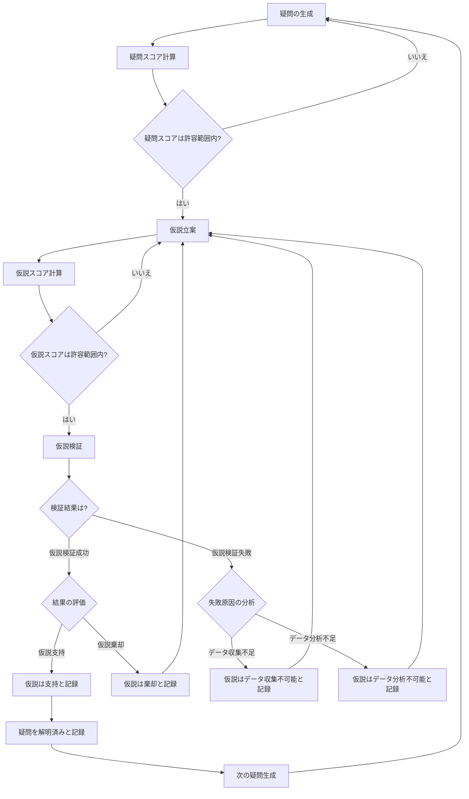

```mermaid
graph TD
    %% 疑問生成フェーズ
    A[疑問の生成] --> B[疑問スコア計算]
    B --> C{疑問スコアは許容範囲内?}
    C -- いいえ --> A
    C -- はい --> D[仮説立案]

    %% 仮説立案と評価フェーズ
    D --> E[仮説スコア計算]
    E --> F{仮説スコアは許容範囲内?}
    F -- いいえ --> D
    F -- はい --> G[仮説検証]

    %% 仮説検証フェーズ
    G --> H{検証結果は?}
    H -- 仮説検証成功 --> I{結果の評価}
    I -- 仮説支持 --> J[仮説は支持と記録]
    I -- 仮説棄却 --> K[仮説は棄却と記録]
    H -- 仮説検証失敗 --> L{失敗原因の分析}

    %% 失敗原因の分析フェーズ
    L -- データ収集不足 --> M[仮説はデータ収集不可能と記録]
    L -- データ分析不足 --> N[仮説はデータ分析不可能と記録]

    %% 疑問解明と次のステップ
    J --> O[疑問を解明済みと記録]
    O --> Q[次の疑問生成]
    Q --> A
    K --> D
    M --> D
    N --> D
```
